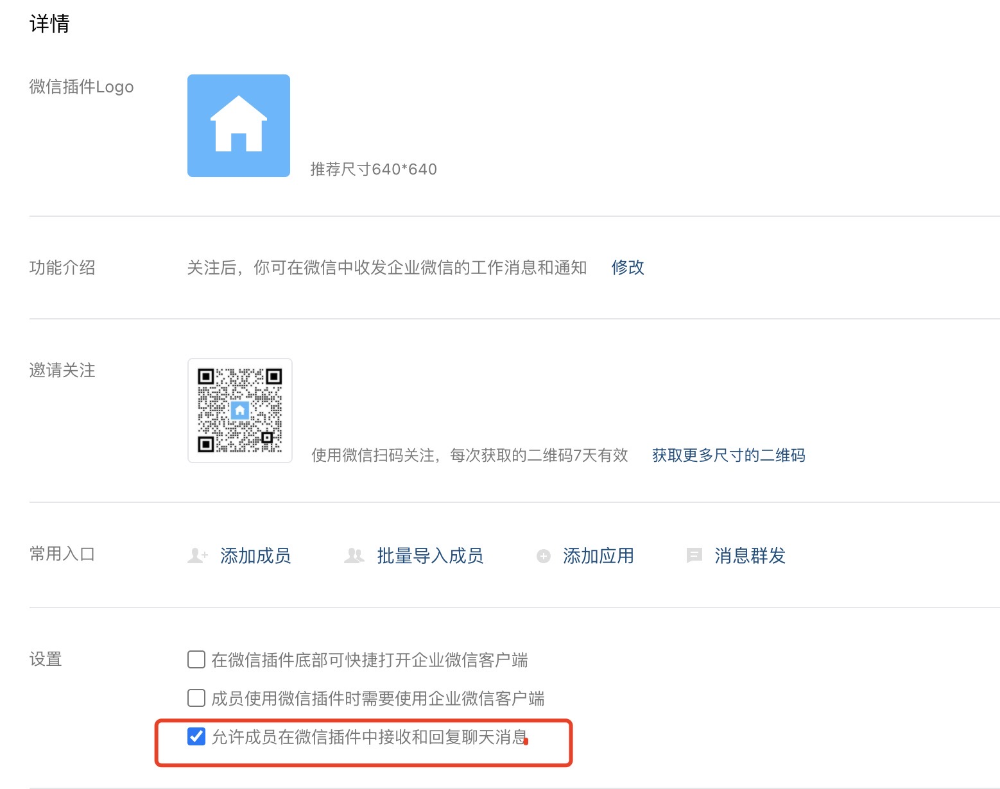

# CS-ServerChan

**通过 CobaltStike 服务端 / 客户端 挂载脚本，将上线主机信息通过 Server 酱通知到微信**

> 如果想使用免费且支持微信模板消息推送的方式可以移步：https://github.com/lintstar/CS-PushPlus

# 前言

**使用旧的 CS Server酱通知脚本时看到了 ServerChan 关于旧版服务 API 下线的通知：**


**那就更新下 sendkey 吧**

# 配置相关信息

**脚本有两个地方需要替换：**

## ServerChan.py

**https://sct.ftqq.com/sendkey  复制自己的 KEY 替换到下面的地方**


这里的通知模板支持 Markdown 格式可以随意替换


> **这里加 Token随机数的原因是Server 酱一分钟内无法发送重复信息**

## ServerChan.cna

**在客户端或者服务端后台挂载时，需要改成 `ServerChan.py` Python 脚本所在的绝对路径（从盘符开始）**


**通过 CobaltStike 服务端 / 客户端 挂载脚本，将上线主机信息通过 Server 酱通知到微信**

# 服务端后台挂载

**把 cna 脚本添加到本地客户端后，如果beacon上线了，这个提醒的请求是从客户端发出的。**

**如果网络有波动，断开了到 teamserver 的连接，就收不到通知了。**

**解决方法是使用 agscript 在服务器端运行cna文件，和挂载 CobaltStrike 一样，把 cna 脚本也挂载到后台：**

```bash
[root@Catherine CS4.3]# screen
[root@Catherine CS4.3]# ./agscript xx.xxx.xx.xxx [port] Catherine [passwd] CS-ServerChan/ServerChan.cna
Initial Beacon Checkin: 2122252342 PID: 3488
Sending server: python3 /root/Tools/CS4.3/CS-SeverChan/ServerChan.py --computernam LINTSTAR82CF --internalip 10.xx.xx.15 --username lintstar
```

**挂载后查看进程：**

```bash
[root@Catherine ~]# ps -a
    PID TTY          TIME CMD
1045504 pts/0    00:00:00 teamserver
1045507 pts/0    00:00:12 java
1049085 pts/4    00:00:00 bash
1049086 pts/4    00:00:08 java
1055932 pts/7    00:00:00 ps
```

## Agscript 用法

**这里 agscript 的用法为：**

```bash
./agscript [host] [port] [user] [pass] </path/to/file.cna>
```

- **[host] # 服务器的 ip 地址。**
- **[port] # cs 的端口号，启动 cs 时有显示。**
- **[user] # 后台挂载脚本时连接到 teamserver 的用户名。**
- **[pass] # 启动服务端 cs 时设置的密码。**
- **[path] # cna 文件的路径。**

# 效果

## 企业微信服务号通知


## 通知详情


# 企业微信应用消息配置说明

> **来源：https://sct.ftqq.com/forward**

**优点：**

1. **一次配置，持续使用**
2. **配置好以后，只需要微信就能收消息，不再需要安装企业微信客户端**

**PS：消息接口无需认证即可使用，个人用微信就可以注册**

## 0x01 注册企业

用电脑打开[企业微信官网](https://work.weixin.qq.com/)，注册一个企业

## 0x02 创建应用

注册成功后，点「管理企业」进入管理界面，选择「应用管理」 → 「自建」 → 「创建应用」


应用名称填入「Server酱」，应用logo到[这里](https://theseven.ftqq.com/20210208142819.png)下载，可见范围选择公司名。


创建完成后进入应用详情页，可以得到应用ID( `agentid` )①，应用Secret( `secret` )②。

注意：`secret`推送到手机端时，只能在`企业微信客户端`中查看。

[](https://camo.githubusercontent.com/ec3ddd2dd460680f9fc61acc8a1bd215fcb947608102764539c4ce43bc1e0f26/68747470733a2f2f746865736576656e2e667471712e636f6d2f32303231303230383134333535332e706e67)

## 0x03 获取企业ID

进入「[我的企业](https://work.weixin.qq.com/wework_admin/frame#profile)」页面，拉到最下边，可以看到企业ID③，复制并填到上方。

推送UID直接填 `@all` ，推送给公司全员。

## 0x04 推送消息到微信

进入「我的企业」 → 「[微信插件](https://work.weixin.qq.com/wework_admin/frame#profile/wxPlugin)」，拉到下边扫描二维码，关注以后即可收到推送的消息。


PS：如果出现`接口请求正常，企业微信接受消息正常，个人微信无法收到消息`的情况：

1. 进入「我的企业」 → 「[微信插件](https://work.weixin.qq.com/wework_admin/frame#profile/wxPlugin)」，拉到最下方，勾选 “允许成员在微信插件中接收和回复聊天消息”

   

2. 在企业微信客户端 「我」 → 「设置」 → 「新消息通知」中关闭 “仅在企业微信中接受消息” 限制条件

    

